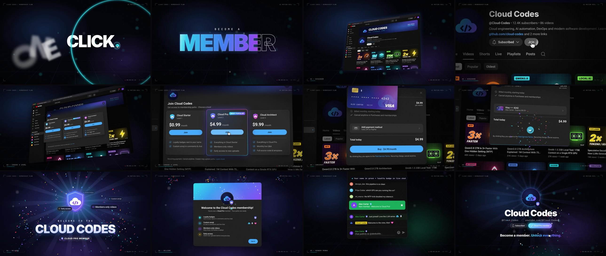

# Cloud Codes · YouTube Membership — Motion Graphics Reel

A 40-second UI motion showreel of a viewer joining the **[Cloud Codes](https://youtube.com/@Cloud-Codes)** channel membership, built entirely in code with [Remotion](https://remotion.dev).

[](out/cloud-codes-membership-reel.mp4)

- **Output:** 1920×1080 · 30 fps · H.264 + AAC stereo, at [`out/cloud-codes-membership-reel.mp4`](out/cloud-codes-membership-reel.mp4)
- **UI:** a faithful recreation of YouTube's desktop dark theme: masthead, guide, channel page, the Join dialog with levels, checkout, the welcome dialog, live chat with member badges, and the members-only shelf.
- **Motion:** a CSS-3D virtual camera with velocity-based motion blur, exploded 3D UI layers, shared-element morphs (the Join button grows into the dialog, and the Buy button morphs into a spinner and then a check mark), kinetic typography, confetti physics, light sweeps, rays and film grain.
- **Sound:** an original 120 BPM track and 26 sound effects, all synthesised from scratch in Python (no samples). Every cut, click and hit lands on the beat.

## Storyboard



| Time | Chapter | What happens |
| --- | --- | --- |
| 0:00 | Hook | "ONE CLICK." → a click shatters the words → "BECOME A MEMBER" slams in → the camera dives into the play button |
| 0:04 | 01 Discover | A red iris opens onto the channel page (skeleton load → content). Subscribe → Subscribed plus a toast. The camera pushes in to **Join** |
| 0:08 | 02 Choose a level | The Join button grows into the membership dialog. An exploded 3D orbit shows the levels. Perks light up, then **Cloud Pro** is picked |
| 0:14 | 03 Checkout | A whip-pan to checkout. A 3D card flies into the payment slot. Buy → spinner → ✓. "Unlocking membership" builds up |
| 0:22 | 04 Welcome | The drop: the loyalty badge flips in, confetti cannons fire, perks orbit, then the badge lands in YouTube's welcome dialog |
| 0:28 | 05 Member perks | Green member name and badge in live chat, members-only videos unlock, the loyalty badge levels up |
| 0:34 | Outro | The whole flow at a glance → end card with a Join button that turns into "Cloud Pro member" |

## Run it

```bash
npm install
npm run studio   # interactive preview in the browser
npm run render   # → out/cloud-codes-membership-reel.mp4
```

Remotion downloads its own headless Chrome on first render. To use an existing Chrome or Chromium instead, set `REMOTION_BROWSER_EXECUTABLE=/path/to/chrome`.

## Use the channel's real artwork

The render ships with vector stand-ins for the logo, banner and thumbnails. Drop the real files into `public/brand/` and render again. They are picked up automatically; no code changes are needed.

| File | Used for |
| --- | --- |
| `public/brand/avatar.png` (or `.jpg`/`.webp`) | Channel logo, used everywhere the avatar appears |
| `public/brand/banner.jpg` | Channel banner on the channel page |
| `public/brand/thumb-1.jpg` … `thumb-8.jpg` | Video grid thumbnails, in the order of `VIDEOS` |
| `public/brand/members-1.jpg` … `members-3.jpg` | Members-only shelf thumbnails |

Everything else, including titles, view counts, subscriber count, membership levels, prices, perks, chat messages and brand colours, lives in [`src/config/channel.ts`](src/config/channel.ts).

## Regenerate the audio

```bash
pip install numpy scipy
npm run audio
```

This rebuilds the music stem and all 26 sound effects, then mixes them into `public/audio/mix.wav`, the master the video plays. The master sits at about -13 LUFS with a -1 dBFS peak ceiling. The stems (`music.wav`, `sfx/*.wav`) are written next to it and are git-ignored.

Sound-effect timing lives in [`src/audio/cues.ts`](src/audio/cues.ts). The music follows the same beat grid as the picture ([`src/config/timing.ts`](src/config/timing.ts), 120 BPM, one beat = 15 frames).

## Project layout

```
src/
  Reel.tsx             main composition (scenes + HUD + grain + soundtrack)
  config/              timing (beat grid) and channel data
  lib/                 3D camera, easing and spring helpers
  ui/                  YouTube dark-theme UI kit (pure, prop-driven components)
  fx/                  backdrop, particles, kinetic type, HUD
  scenes/              Hook · BrowserAct · Drop · Perks · Outro
  audio/               soundtrack + SFX cue sheet
scripts/
  generate_audio.py    procedural music + SFX synthesiser and master mix
  export-cues.mjs      exports the cue sheet for the mixer
  stills.mjs           batch still renderer for frame review
  contact.py           tiles review stills into a contact sheet
public/                fonts (Roboto, Inter, JetBrains Mono), audio, optional brand art
```

---

YouTube, its logo and UI are trademarks of Google LLC. They are recreated here only to demo a membership flow for the Cloud Codes channel, in a motion-design portfolio piece.
